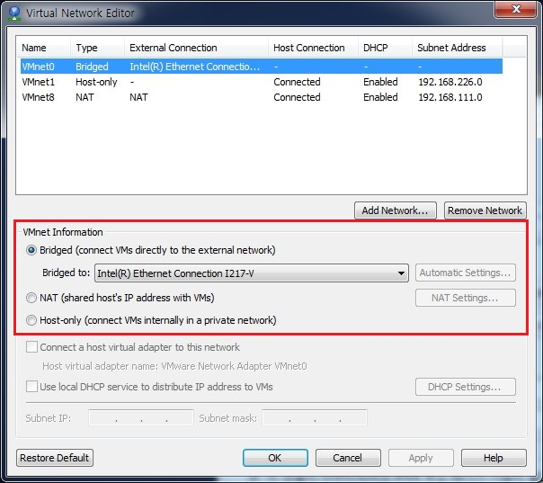
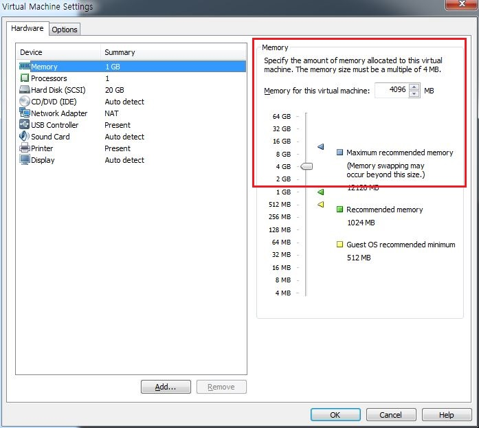
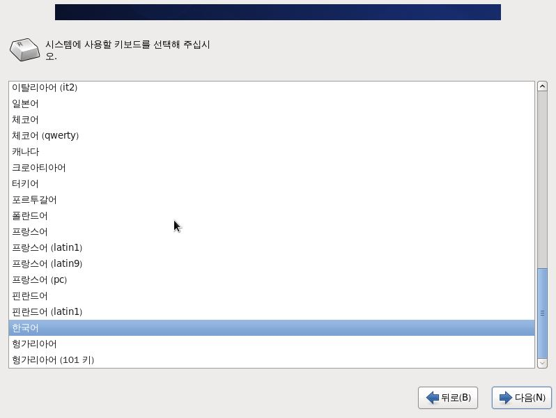
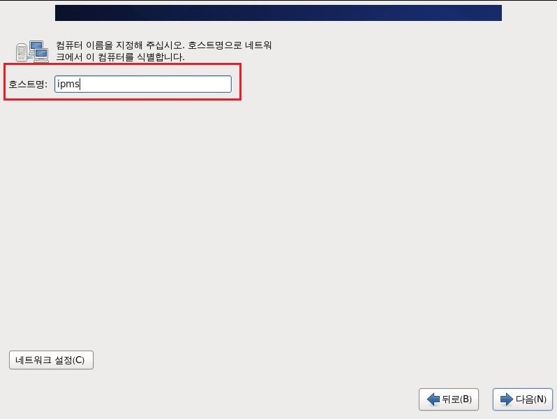
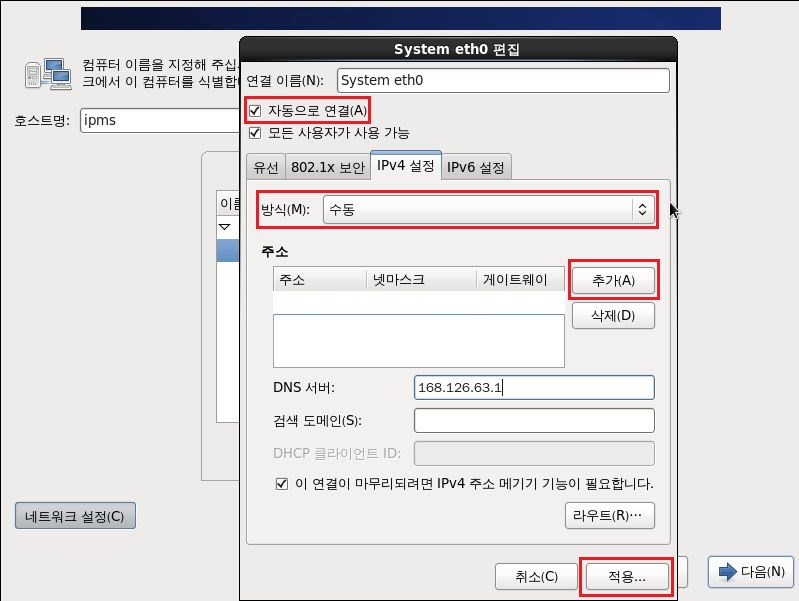
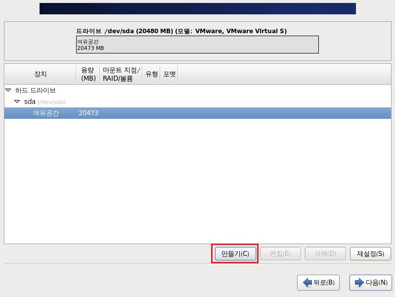
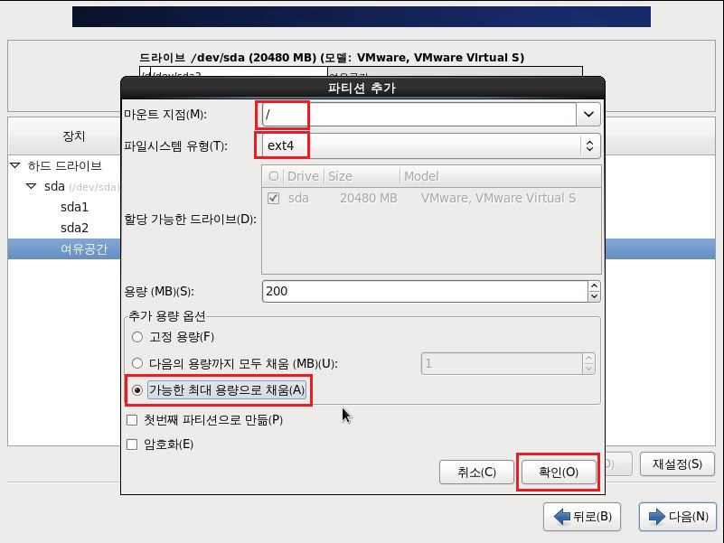
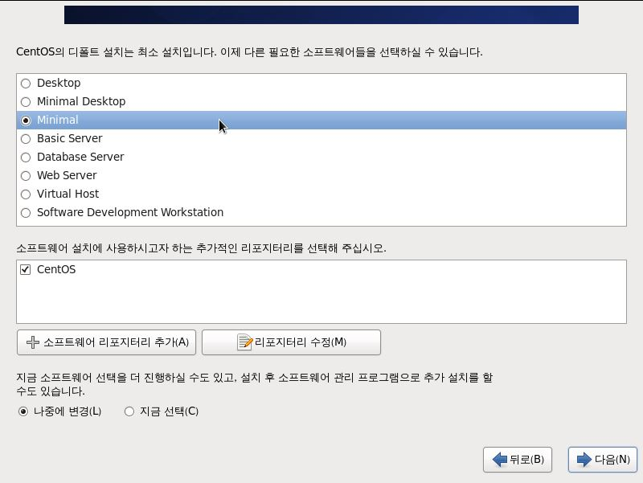

# Install VMware Workstation and CentOS 6
VMware WorkStation 설치 및 CentOS 설치 과정입니다.

## 1. VMware Workstation
### 1.1. VMware Workstation 설치
VMware Workstation 설치 파일을 로컬PC에 복사하고 설치를 진행합니다.  

  

  

  

### 1.2. Default location for virtual machines 설정
VMware Workstation 설치 완료 후 프로그램을 실행시킵니다. 상단메뉴에서 Edit -> Preferences를 클릭합니다.  
해당 버튼을 클릭하면 아래와 같은 화면이 나옵니다. 여기서 Default location for virtual machines의 설정 값을 확인합니다.  
용량이 충분한 곳으로 해당 경로를 설정합니다.  

### 1.3. Bridge Network 설정
상단메뉴에서 Edit -> Virtual Network Editor을 클릭 후 VMnet Information에 Bridge를 선택합니다.  
Bridge to는 Auto에서 본인의 Local PC 네트워크 카드로 변경합니다. 설정 변경 후 Apply를 클릭하여 설정을 적용합니다.  
  

### 1.4. Create a New Virtual Machine
CentOS 6를 설치할 가상 머신을 생성합니다.  
  

Virtual Machine의 type을 선택합니다.  
  

Virtual Machine에 설치할 운영체제 파일의 위치를 지정하는 화면입니다. 아래와 같이 선택 후 넘어갑니다.  
  

Virtual Machine에 설치할 운영체제의 종류를 선택합니다.  
  

Virtual Machine의 이름을 지정합니다.  
  

Virtual Machine에 할당할 Disk 용량을 선택합니다. 아래와 같이 선택 후 넘어갑니다.  
  

Finish 버튼을 클릭하여 Virtual Machine 생성을 완료합니다.  
  

생성된 Virtual Machine의 Memory, Network 등의 설정을 변경을 위해 Edit virtual machine settings 버튼을 클릭합니다.  
  

메모리를 4GB로 설정합니다.  
  

설치할 운영체제 ISO파일이 있는 위치를 선택합니다.
  

Network connection을 Bridged로 선택합니다.  
  

### 1.5. Install CentOS 6  

Install system with basic video driver를 선택하여 설치를 진행합니다.  
  

Virtual Machine에 설치를 하기 때문에 Disk 검사는 Skip을 선택합니다.  
  

  

설치과정에서 사용할 언어는 한국어를 선택합니다.  
  

시스템에서 사용할 키보드를 한국어로 선택합니다.  
  

기본 저장 장치를 선택하고 다음 단계로 넘어갑니다.  
  

중요한 데이터의 저장유무를 확인합니다. 예, 모든 데이터를 삭제합니다를 선택하고 다음 단계로 넘어갑니다.
  

호스트명을 입력합니다.  
  

네트워크 설정 버튼을 클릭하여 IP 주소를 설정합니다.  
  

시스템이 켜졌을 때 네트워크 인터페이스를 켤 수 있도록 자동으로 연결을 선택합니다. IP는 PC가 설치되어 있는 네트워크 환경에 맞춰 설정합니다.  
  

지역을 아시아/서울(Seoul)로 선택합니다.  
  

root 계정의 패스워드를 설정합니다.  
  

파티션 설정을 위해 사용자 레이아웃 만들기를 선택하고 다음 단계로 넘어갑니다.  
  

디스크 드라이브를 선택하고 만들기 버튼을 클릭하여 파티션을 설정합니다.  
  

표준 파티션을 선택합니다.  
  

/boot영역 용량을 512MB로 설정합니다. 파일시스템 유형은 ext4로 선택합니다.  
  

swap영역 용량을 설정합니다. 앞에서 설정한 가상머신의 메모리 용량의 2배로 설정합니다.  
  

/영역 용량을 설정합니다. /boot영역과 swap영역의 용량을 설정하고 남은 모든 용량을 /영역 용량으로 설정합니다.  
  

설정을 확인하고 디스크를 포멧합니다.  
  
  

부트로더 설치 경로를 선택합니다. 기본으로 설정되어 있는 상태에서 다음 단계로 넘어갑니다.  
  

Minimal 선택 후 다음 단계로 넘어갑니다.  
  

설치가 완료 되면 아래와 같은 화면이 표시됩니다.  
  

