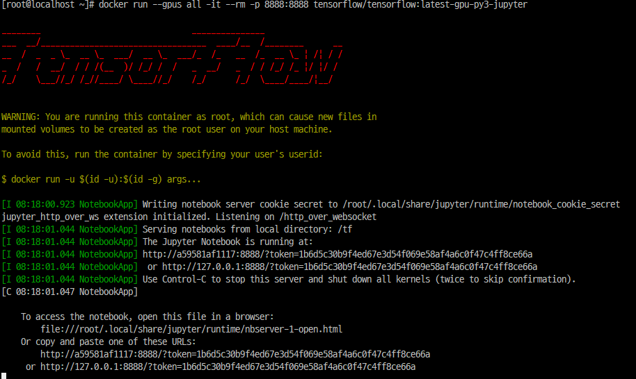
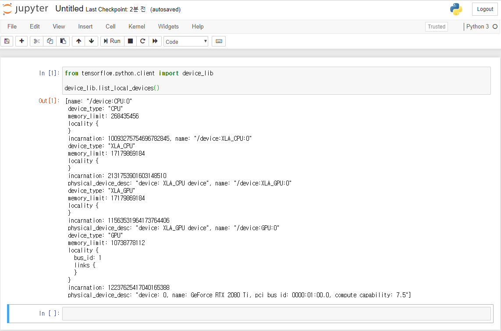

# CentOS 7에서 TensorFlow 2.0 GPU 설치

이 글에서는 NVIDIA 그래픽 카드가 장착된 CentOS 7에서 TensorFlow GPU를 설치하는 방법을 정리합니다.  
[TensorFlow 공식 홈페이지](https://www.tensorflow.org/install/gpu?hl=ko)를 보면 TensorFlow GPU를 사용하기 위해 `NVIDIA GPU Driver, CUDA Toolkit, cuDNN SDK`가 필요하다고 안내하고 있습니다.  
NVIDIA GPU Driver는 RPM 패키지를 이용해 설치하고, CUDA Toolkit과 cuDNN SDK은 [NVIDIA Container Toolkit](https://github.com/NVIDIA/nvidia-docker)을 활용해 설치합니다. 모든 설정이 끝나면 아래 그림과 같은 아키텍처가 됩니다.


# NVIDIA Driver 설치

NVIDIA 공식 홈페이지에 나와 있는 [설치 방법](https://docs.nvidia.com/cuda/cuda-installation-guide-linux/index.html#package-manager-installation)을 참고하여 진행합니다.

```bash
# gcc등 의존성 Library 설치
yum update
yum install epel-release
yum groupinstall 'Development Tools'
yum install dkms yum-utils pciutils

# CUDA-Capable GPU 장비 설치 확인
lspci | grep -i nvidia

# Kernel Headers, Development 패키지 설치
yum install kernel-devel-$(uname -r) kernel-headers-$(uname -r)

# 새로 설치 된 커널적용을 위해 재부팅
reboot

# NVIDIA Driver 설치
yum-config-manager --add-repo http://developer.download.nvidia.com/compute/cuda/repos/rhel7/x86_64/cuda-rhel7.repo
yum clean all
yum install nvidia-driver-latest-dkms

# Driver 적용을 위해 재부팅 및 설치확인
reboot
nvidia-smi

Thu Jul 23 17:00:12 2020       
+-----------------------------------------------------------------------------+
| NVIDIA-SMI 450.51.05    Driver Version: 450.51.05    CUDA Version: 11.0     |
|-------------------------------+----------------------+----------------------+
| GPU  Name        Persistence-M| Bus-Id        Disp.A | Volatile Uncorr. ECC |
| Fan  Temp  Perf  Pwr:Usage/Cap|         Memory-Usage | GPU-Util  Compute M. |
|                               |                      |               MIG M. |
|===============================+======================+======================|
|   0  GeForce RTX 208...  Off  | 00000000:01:00.0 Off |                  N/A |
|  0%   45C    P8    30W / 300W |  10544MiB / 11016MiB |      0%      Default |
|                               |                      |                  N/A |
+-------------------------------+----------------------+----------------------+
                                                                               
+-----------------------------------------------------------------------------+
| Processes:                                                                  |
|  GPU   GI   CI        PID   Type   Process name                  GPU Memory |
|        ID   ID                                                   Usage      |
|=============================================================================|
|    0   N/A  N/A     19990      C   /usr/bin/python3                10541MiB |
+-----------------------------------------------------------------------------+
```

# CUDA Toolkit & cuDNN 설치

## Docker CE 설치

`nvidia-docker`를 사용하기 위해 Docker 19.03 버전 이상을 설치합니다.

```bash
# Docker 설치
yum-config-manager \
    --add-repo \
    https://download.docker.com/linux/centos/docker-ce.repo
yum install docker-ce docker-ce-cli containerd.io

# Docker hello-world 이미지를 통해 설치확인
systemctl start docker
docker version
docker run hello-world
```

## NVIDIA Container Toolkit 설치

```bash
distribution=$(. /etc/os-release;echo $ID$VERSION_ID)
curl -s -L https://nvidia.github.io/nvidia-docker/$distribution/nvidia-docker.repo | \
  sudo tee /etc/yum.repos.d/nvidia-docker.repo
yum install nvidia-container-toolkit
```

## TensorFlow GPU 설치

DockerHub에 저장되어 있는 TensorFlow GPU 이미지를 로컬에 다운받아 실행합니다.

```bash
docker pull tensorflow/tensorflow:latest-gpu-py3-jupyter
docker run --gpus all -it --rm -p 8888:8888 tensorflow/tensorflow:latest-gpu-py3-jupyter
```

성공적으로 컨테이너가 실행되면 아래와 같은 화면이 출력됩니다.



웹브라우저에 `127.0.0.1:8888`을 입력합니다. 주피터 노트북이 실행되면 아래 명령어를 입력하고 Container에서 정상적으로 GPU 장치를 인식하는지 확인합니다.

```python
from tensorflow.python.client import device_lib

device_lib.list_local_devices()
```



위에 그림처럼 설치된 GPU 장치가 출력이 되면 모든 작업이 정성적으로 완료된 것입니다. Docker Container는 종료됨과 동시에 모든 데이터가 날아가게 되어 있습니다. 이를 방지하기 위해서 Host PC에 데이터를 저장하는 방법과 Docker Image의 변경사항을 저장하는 방법에 대해 다음 포스팅에서 정리하도록 하겠습니다.

### 참고자료
> * [NVIDIA Driver Install](https://docs.nvidia.com/cuda/cuda-installation-guide-linux/index.html#package-manager-installation)
> * [Docker Install](https://docs.docker.com/engine/install/centos/)
> * [TensorFlow Install](https://www.tensorflow.org/install/gpu?hl=ko)

### 부록

NVIDIA Driver 설치 시 RPM 패키지 대신 공식 홈페이지에서 다운로드한 run 파일을 활용해 설치하는 방법입니다. 기본 그래픽 드라이버 설정을 변경해야 하는 번거로움이 있으므로 RPM 패키지를 이용해서 설치할 것을 권장합니다.

```bash
# RPM 설치 방법이 실패할 경우 사용
# Runfile installation
# Edit /etc/default/grub. Append the following  to “GRUB_CMDLINE_LINUX”
vi /etc/default/grub
GRUB_CMDLINE_LINUX="crashkernel=auto rd.lvm.lv=centos/root rd.lvm.lv=centos/swap rhgb quiet rd.driver.blacklist=nouveau nouveau.modeset=0"

# Generate a new grub configuration to include the above changes
grub2-mkconfig -o /boot/grub2/grub.cfg

# Edit/create /etc/modprobe.d/blacklist.conf and append:
vi /etc/modprobe.d/blacklist.conf
blacklist nouveau

# Backup your old initramfs and then build a new one
mv /boot/initramfs-$(uname -r).img /boot/initramfs-$(uname -r)-nouveau.img
dracut /boot/initramfs-$(uname -r).img $(uname -r)

# The NVIDIA installer will not run while X is running so switch to text mode
systemctl isolate multi-user.target
reboot

# Run the NVIDIA driver installer and enter yes to all options
sh NVIDIA-Linux-x86_64-*.run

# Check installed driver version
nvidia-smi
```